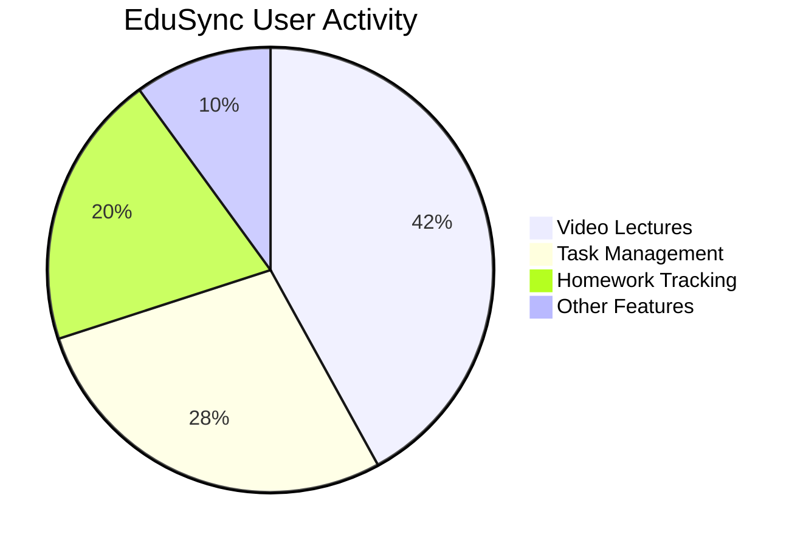
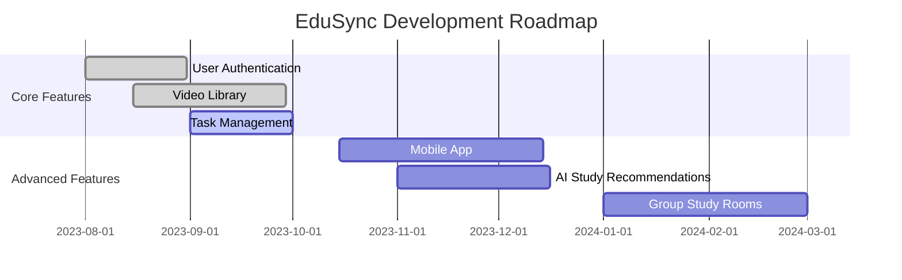
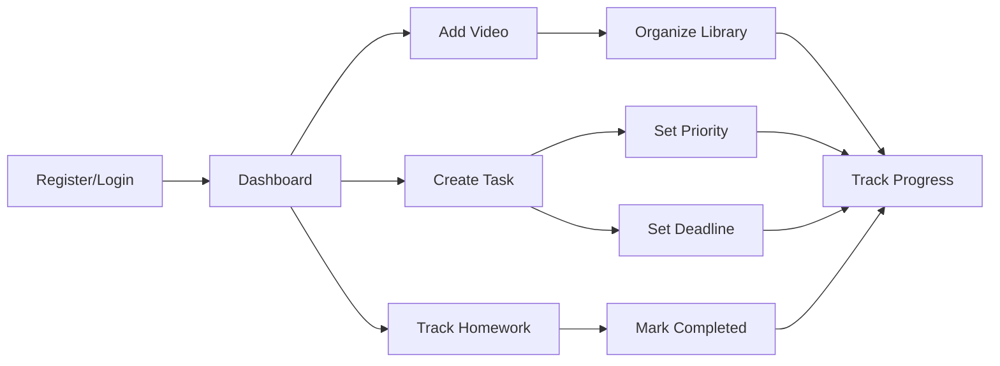

# EduSync 

<div align="center">
  
  

  ### 🎓 The All-in-One Student Study Portal
  
  <p>Supercharge your learning experience with integrated video lectures, task management, and academic tools</p>

  [](https://www.djangoproject.com/)
  [](https://www.python.org/)
  [](LICENSE)
  [](CONTRIBUTING.md)
  
</div>

## 📊 Usage Statistics

<div align="center">



</div>

## ✨ Features

<table>
  <tr>
    <td width="50%">
      <h3>📺 Video Learning Hub</h3>
      <ul>
        <li>YouTube integration with one-click saving</li>
        <li>Direct video uploads supported</li>
        <li>Smart organization by subject/topic</li>
      </ul>
    </td>
    <td width="50%">
      <h3>✅ Task Management</h3>
      <ul>
        <li>Priority-based task system</li>
        <li>Due date tracking with reminders</li>
        <li>Customizable status workflows</li>
      </ul>
    </td>
  </tr>
  <tr>
    <td width="50%">
      <h3>📝 Homework Tracker</h3>
      <ul>
        <li>Assignment deadlines with countdown</li>
        <li>Progress visualization</li>
        <li>Completion statistics</li>
      </ul>
    </td>
    <td width="50%">
      <h3>🔍 Smart Search</h3>
      <ul>
        <li>Full-text search across all content</li>
        <li>Multi-parameter filtering</li>
        <li>Recent & favorite quick access</li>
      </ul>
    </td>
  </tr>
</table>

## 🚀 Quick Start

```bash
# Clone repository
git clone https://github.com/yourusername/edusync.git
cd edusync

# Setup environment
python -m venv venv
source venv/bin/activate  # On Windows: venv\Scripts\activate
pip install -r requirements.txt

# Initialize application
python manage.py migrate
python manage.py createsuperuser
python manage.py runserver

# Access at http://127.0.0.1:8000/
```


## 📈 Implementation Roadmap



## 💻 Tech Stack

<div align="center">
  
| Frontend | Backend | Database | Deployment |
|:--------:|:-------:|:--------:|:----------:|
| HTML5 | Django 4.0+ | PostgreSQL | Docker |
| CSS3/SCSS | Python 3.8+ | Redis | Nginx |
| JavaScript | Django REST | SQLite (Dev) | GitHub Actions |
| Bootstrap 5 | Celery | - | AWS/Heroku |

</div>

## 🔄 Workflow

<div align="center">



</div>

## 🤝 Contributing

Contributions are what make the open-source community such an amazing place to learn, inspire, and create. Any contributions you make are **greatly appreciated**.

<details>
<summary>Click to expand contribution guidelines</summary>

1. Fork the project
2. Create your feature branch (`git checkout -b feature/amazing-feature`)
3. Commit your changes (`git commit -m 'Add some amazing feature'`)
4. Push to the branch (`git push origin feature/amazing-feature`)
5. Open a Pull Request

See [CONTRIBUTING.md](CONTRIBUTING.md) for detailed guidelines.
</details>

## 📜 License

Distributed under the MIT License. See [LICENSE](LICENSE) for more information.

## 📞 Contact & Support

<div align="center">
  
[](mailto:vendotha@gmail.com)
[](https://github.com/vendothaa/edusync/issues)


</div>

---

<div align="center">
  <sub>Built with ❤️ by the Bhuvan Vendotha</sub>
  
  ⭐ Star this repo if you find it useful! ⭐
</div>
